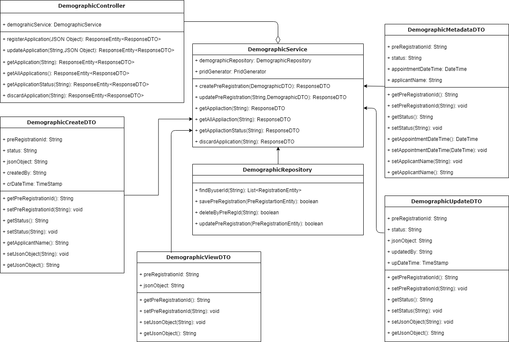
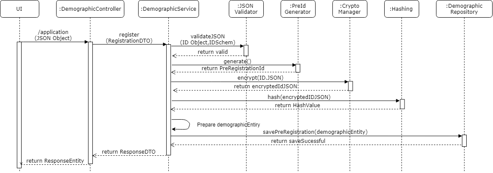
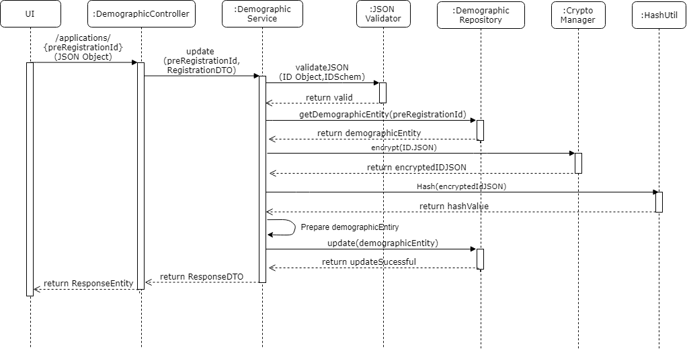
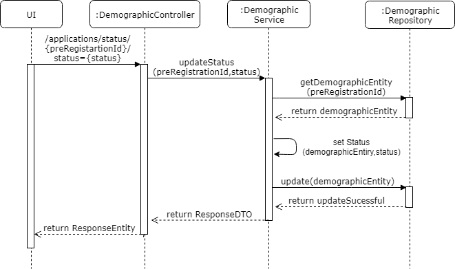
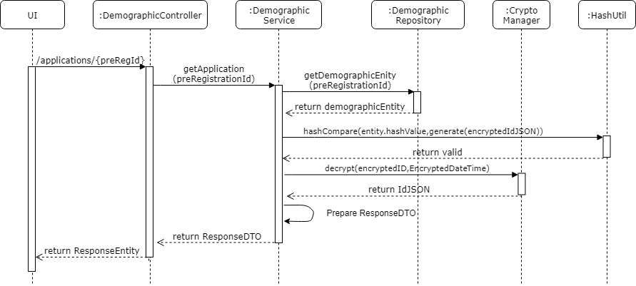
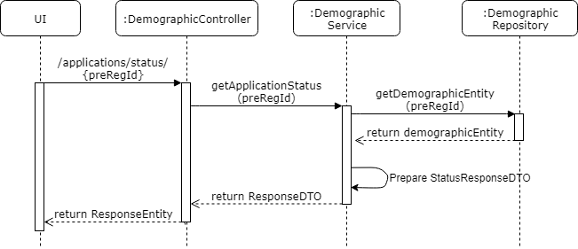
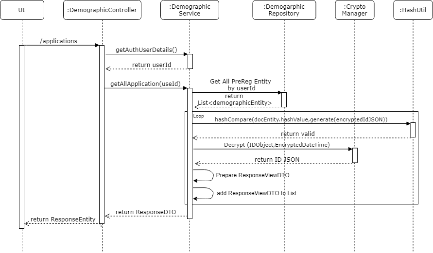
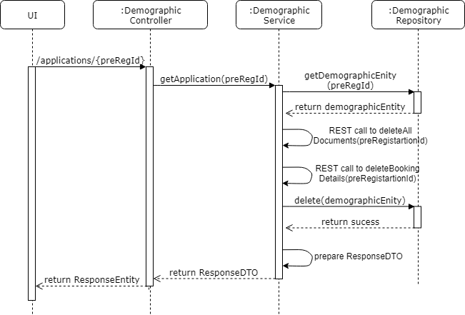

# Approach for pre-registration demographic service 

**Background**
- Exposing the REST API to create pre-registration for a citizen, where the data captured in the pre-registration portal should be stored.

The target users are -
   - Pre-Registration portal
   
The key requirements are -

1. Create the API to store the demographic details of the citizen for a pre-registration, where the data captured in the pre-registration portal should be stored.
2. Pre-Registration Id should get generated and assigned to demographic details and it should be stored in encrypted JSON in database.
3. Once the pre-registration form is stored in database then it should be in "Pending Appointment" status.
4. The API should return the success / failure status code along with the respective message.

The key non-functional requirements are

- Security :
    - The Pre-Registration JSON form should be encrypted.
	- Generate hash out of encrypted JSON.
	- Compare hash while retrieving the data.
-   Log the each state of the pre-registration creation:
    -   As a security measures the Pre-Id or applicant information should not be logged.
-   Audit :
    -   Each state of the Pre-Registration creation should be stored into the DB for audit purpose.
    -   Pre-reg Id and important detail of the applicant should not be audited.
-   Exception :
    -   Any exception occurred during the pre-registration, the same will  be reported to the user with the user understandable exception.

**Solution**

**Class Diagram**

**Create a new pre-registration :**

1. Create a REST API as '/applications' with POST method which accept the ID Definition JSON object (#id-definition-structure) from the request body.
2. Validate the request object against the ID Definition schema, If the provided request ID JSON object is valid then continue with the rest of the process otherwise throw an respective error message.
3. Generate the pre-registration id and assign to the requested ID JSON object and set it to the database entity.
4. Encrypt the ID JSON with current time-stamp and set it to the database entity. If the encryption is successful continue otherwise throw an respective error message. 
5. Generate hash out of encrypted ID JSON and set it to the database entity. If the hash function is successful continue otherwise throw an respective error message. 
6. Save the per-registration entity in the database. If data save successful in database render the successful response otherwise any database exception occurs then rollback the current transaction and throw the respective exception otherwise.
7. Audit the exception/start/exit of the each stages of the Pre-registration save mechanism using AuditManager component.

**Sequence Diagram**

**Update existing pre-registration :**

1. Create a REST API as '/applications' with PUT method which accept the ID Definition JSON object (#id-definition-structure) from the request body and pre-registration id from request parameter.
2. Get the existing per-registration entity from database by pre-reg id. If data is not present in the database throw an respective exception.
3. Validate the requested ID JSON against the ID Definition schema, If the requested ID JSON is valid then continue otherwise throw an respective error message.
4. Encrypt the ID JSON with current time-stamp and set it to the database entity. If the encryption is successful continue otherwise throw an respective error message. 
5. Generate hash out of encrypted ID JSON and sand set it to the database entity. If the hash function is successful continue otherwise throw an respective error message. 
6. Update the per-registration entity in the database. If data update successful in database render the successful response otherwise any database exception occurs then rollback the current transaction and throw the respective exception otherwise.
7. Audit the exception/start/exit of the each stages of the Pre-registration update mechanism using AuditManager component.

**Sequence Diagram**

**Update existing pre-registration status:**

1. Create a REST API as '/applications/status' with PUT method which accept the pre-registration id from request parameter and status in query parameter.
2. Get the existing per-registration entity from database by pre-reg id. If data is not present in the database throw an respective exception.
3. Set the per-registration entity with new status.
4. Update the per-registration entity in the database. If data update successful in database render the successful response otherwise any database exception occurs then rollback the current transaction and throw the respective exception otherwise.
5. Audit the exception/start/exit of the each stages of the Pre-registration update status mechanism using AuditManager component.

**Sequence Diagram**

**Retrieve existing pre-registration :**

1. Create a REST API as '/applications' with GET method which accept the pre-registration id from request parameter.
2. Get the existing per-registration entity from database by pre-reg id. If data is not present in the database throw an respective exception.
3. Retrieve the user-id from the authorization token and compare with user-id present in entity, if it success then proceed with next operation otherwise throw an respective exception.
4. Generate hash out of encrypted ID JSON and compare with the existing hash from the entity, if it success then proceed with next operation otherwise throw an respective exception.
5. Then decrypt ID JSON using time-stamp of encryption by using KERNEL API, send a successful response with ID JSON otherwise throw an respective exception.
6. Audit the exception/start/exit of the each stages of the Pre-registration retrieve mechanism using AuditManager component.

**Sequence Diagram**

**Retrieve existing pre-registration status:**

1. Create a REST API as '/applications/status' with GET method which accept the pre-registration id from request parameter.
2. Get the existing per-registration entity from database by pre-reg id. If data is not present in the database throw an respective exception.
3. Then status of the pre-registration given into the response.
4. Audit the exception/start/exit of the each stages of the Pre-registration retrieve mechanism using AuditManager component.

**Sequence Diagram**

**Retrieve All existing pre-registration for the User:**

1. Create a REST API as '/applications' with GET method.
2. Retrieve the user-id from the authorization token.
3. Get the all per-registration entity from database by user-id. If data is not present in the database throw an respective exception.
4. Loop all per-registration entities and generate hash out of encrypted ID JSON and compare with the existing hash from the entity, if it success then proceed with next operation otherwise throw an respective exception.
5. Then decrypt ID JSON using time-stamp of encryption by using KERNEL API, Get the required field values from the entity and construct an object and assign to the list with ID JSON otherwise throw an respective exception.
6. Send the list of object into the response.
7. Audit the exception/start/exit of the each stages of the Pre-registration retrieve all mechanism using AuditManager component.

**Sequence Diagram**

**Discard Pre-Registration:**
1. Create a REST API as '/applications' with DELETE method which accept the pre-registration id from request parameter.
2. Retrieve the user-id from the authorization token.
3. Get the existing per-registration entity from database by pre-reg id. If data is not present in the database throw an respective exception.
4. Compare user-id with entity's user-id. if it matches then delete the record from the database and send the success response otherwise throw an respective exception.
5. Audit the exception/start/exit of the each stages of the Pre-registration delete mechanism using AuditManager component.

**Sequence Diagram**

**Success / Error Code** 

 While processing the Pre-Registration if there is any error or successfully
 then send the respective success or error code to the UI from API layer as  Response object.

  Code   |       Type  | Message|
-----|----------|-------------|
  0000      |             Success |   Packet Successfully created
  PRG_PAM_APP_001 |  Error   |   Unable create the pre-registration.
  PRG_PAM_APP_002  | Error   |   Pre-Registration table not accessible
  PRG_PAM_APP_003 |  Error   |   Delete operation not allowed
  PRG_PAM_APP_004  | Error   |   Failed to delete the registration
  PRG_PAM_APP_005 |  Error    |  Unable to fetch the registrations

**Dependency Modules**

Component Name | Module Name | Description | 
-----|----------|-------------|
  Audit Manager     |   Kernel        |    To audit the process while creating the pre-registration.
  Exception Manager  |  Kernel     |       To prepare the user defined exception and render to the user.
  Log        |          Kernel         |   To log the process.
  JOSN Utility    |     Kernel       |     To validate the ID definition JSON object over ID Definition Schema
  Pre-Id Generator    |    Kernel      |      To get the generated Pre-Registration Id
  Database Access   |    Kernel      |      To get the database connectivity